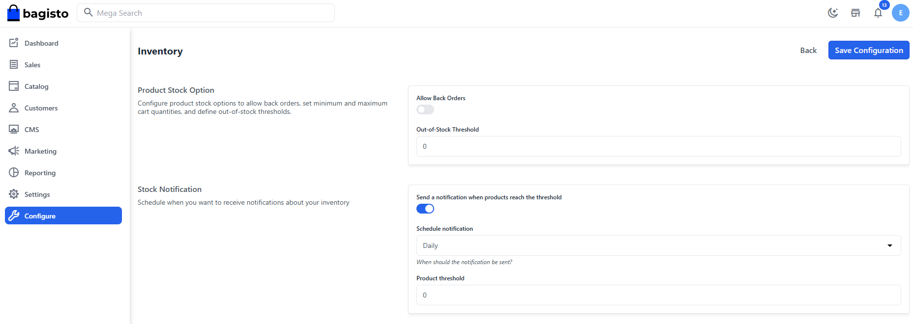

<p align="center">
    
    <h2 align="center">Stock Notify</h2>
</p>

<p align="center">
  
  
</p>

## Topics
1. [Introduction](#introduction)
2. [Installation](#installation)
3. [Requirements](#requirements)
4. [Configuration](#configuration)

## Introduction
With this package you can keep an eye on your inventory. The way it works is simple.  
Each time a customer purchases a product, the product's inventory is reduced and if the inventory reached the threshold, administrators will receive a export (xlsx) file  hourly, daily or weekly in their mailbox.

## Installation
```
composer require bagisto-eu/stock-notify
```
Once the package is installed run the following command
```
php artisan optimize
```

## Requirements
We only need to add a single **cron configuration** entry to our server that runs ´artisan schedule:run` every minute:  

```
* * * * * cd /path-to-your-bagisto-folder && php artisan schedule:run >> /dev/null 2>&1`
```

## Configuration
1. Go to **Configure->Catalog->Inventory**.
2. Enable `Send a notification when products reach the treshold`.
3. Define the schedule for notifications.
4. Define the minimum stock (treshold).

